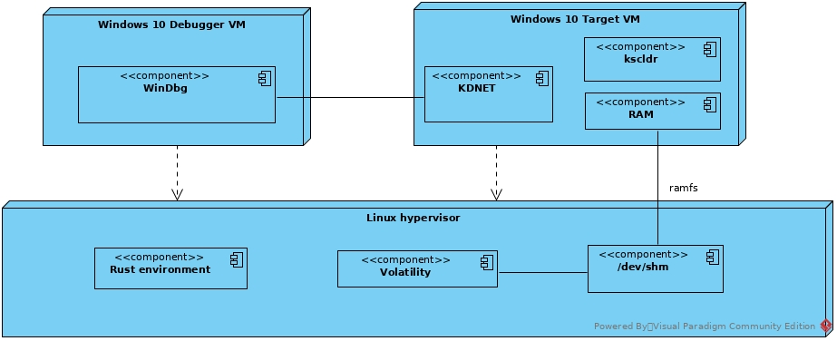
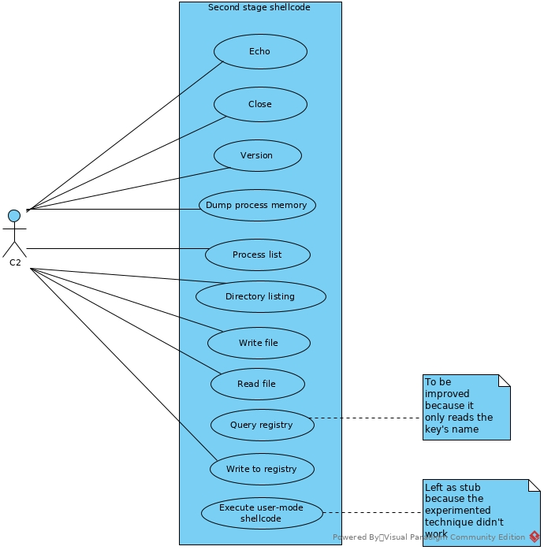
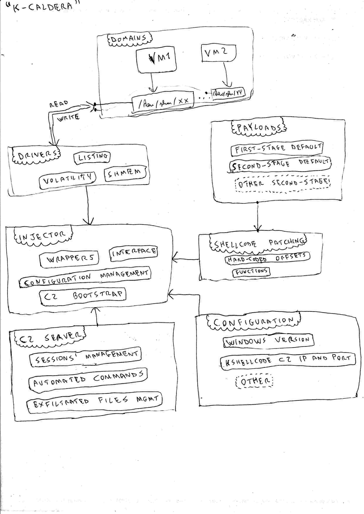
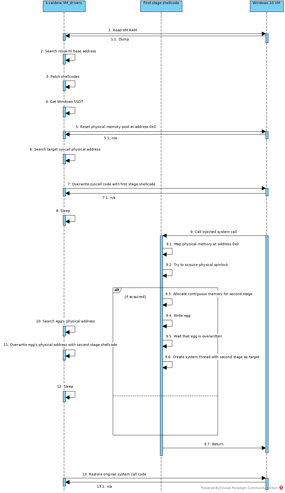
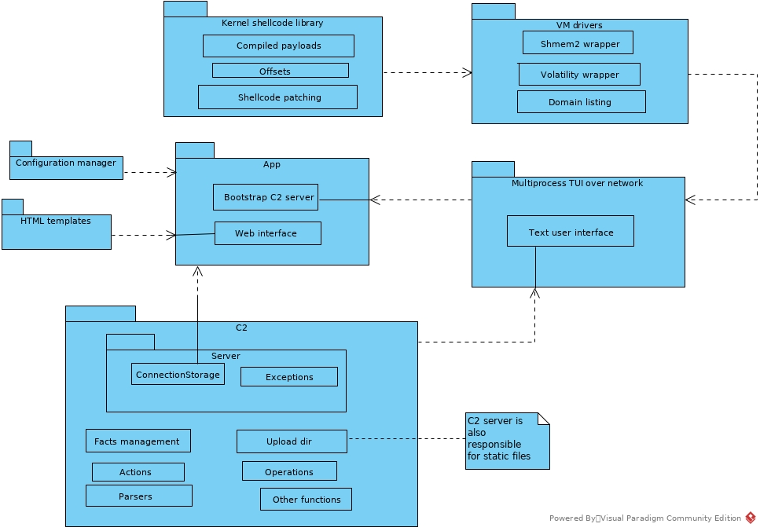
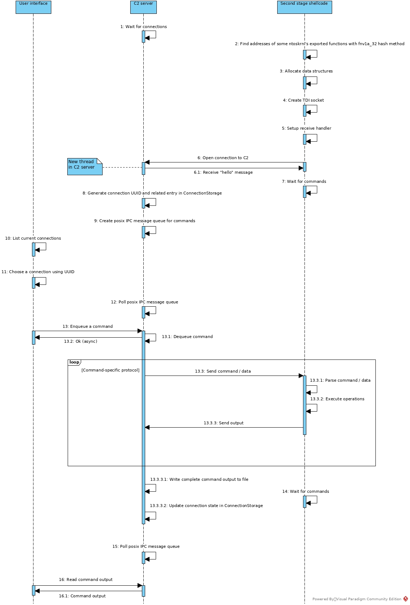
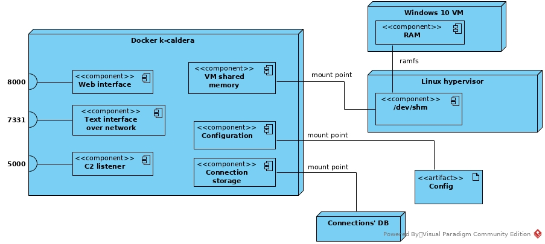
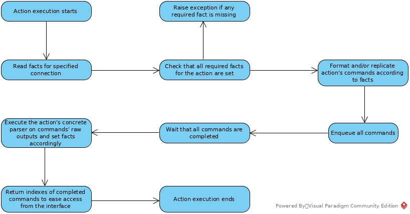

# adversary-emulation

## TLDR
This framework allows for the injection of a high-privileged agent in the kernel of a guest OS from the hypervisor's privileges. It currently supports some versions of Windows 10 as guest OS, and the portability w.r.t. the hypervisor is left to the user, that has to configure the hypervisor such to have the RAM of the guest OS backed on a file of the host OS, in this way the host OS can read/write the physical memory of the guest in real-time. The framework is executed as a Docker container, that has ```/dev/shm``` as mount point, and expects to find the file-backed RAM (called ```pc.ram```, can be changed by modifying ```config/config.json```) in sub-folders of ```/dev/shm``` (in this way, the RAM is file-backed, but the file is internally backed on the RAM of the host OS, to reclaim performance). This assumes that the host OS is Linux and that it's able to run both Docker containers and VMs. The setup was done, in particular, for ```libvirt+qemu+kvm``` (with ```gnome-boxes``` as front-end), see ```vm``` folder.

### Future developments roadmap
The following list may change, and the ticked boxes could still require some minor enhancements. The boxes are unsorted.

- [ ] Perform successful injections against Kaspersky (in general, study and improve reliability of the injection)
- [ ] Refactor the project structure and review modules developed in the first sprints
- [ ] Automate deployment (both of target VM and of the tool, "Laccolith")
- [x] Easy portability for new Windows versions either with kernel debug or with Volatility (both methods are available)
- [ ] Injection chain and payloads for other operating systems (to be defined)
- [x] Ring0-to-Ring3 escape in Windows (for user-mode payloads; implemented with worker factories)
- [ ] Deployment with VMWare ESXi instead of Qemu+KVM
- [ ] Test the injection chain in presence of technologies like Intel TDX

### Usage
After having done the proper setup for the VM and changed the configuration accordingly, you just have to use the ```docker-compose.yml``` file to build the framework and run it. Connect to port 8000 for the web interface and to port 7331 for the text user interface, which allows for commands and is self-documented (with "help" and "info" meta-commands).

More details are provided in the next sections, and even more details, since this project is for a Master Thesis in Computer Engineering, are available in ```docs/thesis``` and ```docs/presentation```, which are in English :) .

## Introduction
From [here](https://plextrac.com/what-is-adversary-emulation-adversary-simulation/): "adversary emulation is a type of red (or purple) team engagement that uses real-world threat intelligence to impersonate the actions and behaviors that your red team (or bad actors) would use in practice".

It's important for red teams to automate their activities in a more effective way, and it's important for blue teams to train themselves to identify and fill attacks.

Many frameworks are available for adversary emulation, one of the most notable is MITRE's [Caldera](https://caldera.mitre.org/).

The first part of this research is an empirical study intrusiveness and detectability of existing solutions, in particular Caldera, even if combined with anti-detection tools like [Inceptor](https://github.com/klezVirus/inceptor).

The research showed that even the most hardened Caldera+Inceptor configuration (xor encoding, shikata-ga-nai, delayed execution, LLVM binary code obfuscation, hidden window, signed binary using CarbonCopy, unhook technique for EDR bypass) has a low success rate against the Windows Defender alone.

This is because the Caldera agent is a regular process and uses dummy execution techniques to perform its actions, like powershell commands.

Therefore, it is okay for the emulation of a basic adversary, but not for the emulation of a skilled adversary, which uses 0-day exploits and gets fully undetected by current AV/EDR solutions.

The ideal state-of-the-art for adversary emulation should be capable of emulating skilled adversaries, also offering the possibility of configuring the evasion capabilities, to make some activities more detectable.

So, the second part of this research starts by considering a scenario in which the attacker was able to compromise an hypervisor with a 0-day exploit (like in [this article](https://googleprojectzero.blogspot.com/2017/04/pandavirtualization-exploiting-xen.html)), and wants to leverage the gained arbitrary read/write access to any virtual machine's RAM to inject an agent in a VM. <br>
In particular the case study is a Windows 10 VM, whereas the post-exploitation phase of the hypervisor is simulated with the help of virtual machine introspection ([volatility](https://www.volatilityfoundation.org/)) techniques performed on the live RAM image.

Given these premises, the target now is to inject an agent with defense evasion capabilities in a Windows 10 VM only using the arbitrary read/write access to the RAM (bypassing page permissions). <br>
If it is possible, then the next steps would be to automate the full chain to have a Caldera-like behaviour and to study the detectability in presence of different AV/EDR solutions.  

## Implementation
The first thing to do was to setup the virtual machine in order to get live read/write access to the RAM. <br>
The environment was a Linux host, with ```qemu-system-x86_64```, ```Libvirt``` and ```KVM``` support. <br>
In particular, it was used ```gnome-boxes``` as frontend. <br>
The solution was not straightforward to find, but it's easy to replicate. <br>
The idea is to have a file-backed RAM for the VM, using the ```ramfs``` protocol, then make the folder in which virtual machines' live RAM images are stored a symbolic link to ```/dev/shm``` to reclaim performance. Additional technical details can be found in ```vm``` sub-folder of this repository.

At this point, the requirement is to use the gained access to emulate an adversary which wants to inject an agent in the VM.

The general way of getting arbitrary code execution using arbitrary read/write is corrupting some data structures in memory to redirect execution flow after that the code will, eventually, use these data structures.

Anyway, this approach has the problem of the "semantic gap": when dealing with raw memory, the "injector" sees physical addresses, whereas the code sees virtual addresses. <br>
In addition to that, the code doesn't bypass the MMU, so it always has to reference valid virtual addresses. <br>
So the injector can overwrite any data structures it wants, but doesn't have an allocated space to place its code into.

It has to change strategy, then. Usually, text areas of processes (where the assembly code is) are not-writeable pages. <br>
But, since the memory access is done from the hypervisor, any byte of memory is readable and writeable. <br>
So it's possible to directly overwrite some code which will be eventually called and use it to inject an agent.

Now there are two open questions:

- which code to overwrite (with high privileges) and (sub-question) how to find it automatically to automate the injection?
- what to inject there and (sub-question) how to handle the fact that it can be called multiple times?

About the first question, it was taken the decision to overwrite kernel code, in particular some system call's code, because system calls are (of course) executed in kernel mode and they are (less obviously) called in PASSIVE_LEVEL (you can see it by doing kernel debug, setting a breakpoint on a system call and using ```!irql``` meta-command to see the debugger-saved IRQL, which will be 0). <br>
And they're also quite easy to find automatically, with a combination of Volatility (```windows.ssdt``` plugin) and a raw memory lookup of system call's code (to "convert" the virtual address to a physical address).

Why do we care about the PASSIVE_LEVEL? <br>
Because, once in kernel mode, we have to use Windows' internal kernel functions, in particular functions available to drivers, which are documented [here](https://learn.microsoft.com/en-us/windows-hardware/drivers/ddi/). <br>
From the documentation, we can see that most of the functions require to be called in PASSIVE_LEVEL, and also by doing some reverse engineering in the kernel debug we can see that the code of these functions performs the necessary checks to ensure that it's called with the right IRQL.

At this point, the next step is to choose a system call to overwrite, with "enough space" to contain the malicious code; the malicious code also needs to handle the case of being called multiple times, and needs to somehow exit gracefully without hanging forever.

It's already clear that, for space requirements and for behaviour requirements, the "malicious code" which overwrites the system call can't be the "agent" itself, but will be responsible for the allocation of the code region for the agent and the asynchronous execution of the agent in that area. <br>
For this reason, the injection is a multi-stage process, and the "malicious code" will be referred to as "first stage shellcode" for now on and the "agent" will be referred to as "second stage shellcode".

The first stage shellcode will overwrite a system call for a short period of time, long enough to "communicate" to the hypervisor that the area for the second stage shellcode is ready; the hypervisor will write the second stage shellcode to that area, then the first stage shellcode will start a "system thread" to execute the second stage shellcode and will return. <br>
Other concurrent calls to the system call will immediately return, using some synchronization pattern. <br>
After the start of the second stage shellcode, the original system call code can be restored.

Now, after having thought about "how" to perform the injection of the agent, let's think about "what" to inject. <br>
The second stage shellcode is an agent, or rather it must open a connection to a C2 server and implement a set of commands, to perform the actions required by some adversary emulation campaigns. <br>
And don't forget that it executes in kernel mode.

In this way, the second stage shellcode (but also the first stage) is very similar to a rootkit.

Much research and browsing was about finding something similar to a rootkit, but not too hard to modify and extend. <br>
The best resource, by far, was this one: [SassyKitdi by zerosum0x0](https://zerosum0x0.blogspot.com/2020/08/sassykitdi-kernel-mode-tcp-sockets.html).

The core of the second part of the research is built around this project. <br>
It creates a reverse TCP socket using the [Transport Driver Interface](https://en.wikipedia.org/wiki/Transport_Driver_Interface), then it sends Windows version and the memory dump of lsass.exe process over the wire; on the other hand, a minidump is created out of received data.

The interesting thing, which makes this project more appealing than kernel-level backdoors like [DoublePulsar](https://en.wikipedia.org/wiki/DoublePulsar), is the fact that SassyKitdi is not just an assembly payload, it is a Rust library organized in such a way to produce a position-independent shellcode. <br>
In fact, by fine tuning the Rust compilation process (with cross-compilation to a Windows DLL), by disabling the usage of the standard library, by using a certain programming style and by using some useful abstractions (like specifying "extern" functions with "stdcall" convention to call Windows kernel's internal functions, or by using inline assembly to implement certain functions), it is possible to use an high-level language and reliably obtain a working shellcode by extracting the startup section of the compiled DLL.

Without having the multi-stage injection chain ready, the only way to test it was to use a driver to load kernel shellcodes. <br>
It was used a driver developed by FireEye, called [kscldr](https://github.com/mandiant/flare-kscldr).

In addition to that, since a kernel shellcode could crash the system, it was setup an environment with kernel debug, using [KDNET](https://learn.microsoft.com/en-us/windows-hardware/drivers/debugger/setting-up-a-network-debugging-connection-automatically). <br>
The overall architecture of the test and debug environment is shown in the following diagram.



It took a significant effort to go from the original Rust code to a basic agent with "echo" as only command, because:

- Rust code wasn't friendly, so the first thing was to understand it and the tricks that made the compiled code position-independent;
- SassyKitdi was tested with [KVA Shadowing](https://msrc-blog.microsoft.com/2018/03/23/kva-shadow-mitigating-meltdown-on-windows/) disabled, and its technique to find ```ntoskrnl``` base address didn't work in presence of the KVA Shadowing's page guards: the solution was to use the hypervisor privilege to leak ```ntoskrnl``` base address (using Volatility's ```windows.modules``` plugin) and patch the shellcode bytes before loading/injecting it;
- TDI operations had an hard-coded timeout of 1 second, which is too low for something executing in PASSIVE_LEVEL: the naive solution was to increase the timeout to 15 seconds;
- the socket's receive handler was only a stub always sending ACK, so it took a bit of reverse engineering to understand how to modify it and how to develop a synchronization protocol between the shellcode's "main" and the receive handler (which executes at DISPATCH_LEVEL);
- the shellcode didn't terminate gracefully.

After having solved all of the previous problems, it came the implementation of some commands in the second stage shellcode, either by re-using/extending code in some "common" crates (a "crate" is a Rust package) or by creating new crates (for example for the management of the file system and of the system registry). <br>
It was also compulsory to implement some functions for a basic parsing of received commands, always with the requirement of the position-independent compilation (so it wasn't possible to use strings, because they would have gone in the global area).

For the configuration of the evasion capabilities, it was also necessary to implement a command to execute some code in user-mode, i.e. a "ring0-to-ring3" function; this is a common problem in rootkits, not because they want to be detected but because they want to have access to higher-level functions available in user-mode. <br>
Many approaches were explored (see the section "Future developments"), but at last the related command was left as stub, because it needs to be portable and reliable.

Commands implemented are shown in this diagram:



When the second stage shellcode was mature enough, it was time to go back to the development of the injection chain with the first stage shellcode.

The first stage shellcode needed to be much shorter than the second stage, so instead of finding ```ntoskrnl``` exported functions at run-time by iterating on the module's export table, it used hard-coded offsets to ```ntoskrnl``` base address. <br>
The portability is easily implemented in the automation tool with a "version" configuration parameter and hard-coded offsets for a set of versions, to patch shellcode bytes at run-time before injection or to raise an exception if it is selected a version for which the portability is missing.

Since the injector sees physical addresses and the second stage shellcode is bigger than the size of a page (~10 KB against 4 KB), the first stage shellcode needs to allocate contiguous memory for the second stage; this is accomplished using the function [MmAllocateContiguousMemory](https://learn.microsoft.com/en-us/windows-hardware/drivers/ddi/wdm/nf-wdm-mmallocatecontiguousmemory). <br>
So, it allocates 16 KB of contiguous memory, and writes a "very random cookie" to it, whose value is known by the injector. <br>
This "cookie" is called "egg" because the injector has to search it and overwrite it with the second stage shellcode, which is bigger, so "the egg hatches". <br>
The first stage shellcode periodically reads the memory in which the egg is located to see if it has changed; if it has changed, then the second stage shellcode has been written there, so it allocates memory for a thread handle and uses [PsCreateSystemThread](https://learn.microsoft.com/en-us/windows-hardware/drivers/ddi/wdm/nf-wdm-pscreatesystemthread) specifying the address of the area in which the second stage shellcode is located as ```StartRoutine```.

The only other thing the first stage shellcode has to implement is the synchronization pattern to handle concurrent calls: it must ensure that its "main" is executed one and only one time. <br>
To do that, it implements a fast function to "try to acquire" a spinlock, using [xchg](https://www.felixcloutier.com/x86/xchg#description) instruction in inline assembly. <br>
But, where is the spinlock located? <br>
Usually, when multiple threads need synchronization, the thread which starts them allocates for them the necessary synchronization objects: in fact, if each thread allocated them on its own, they would be different objects. <br>
To solve this problem, since there aren't pre-allocated synchronization objects, it is necessary to use an allocation primitive which is able to return pointers to the same memory area. <br>
So, physical addresses must be specified as input parameters of this allocation primitive. <br>
In Windows the function with these requirements is [MmMapIoSpace](https://learn.microsoft.com/en-us/windows-hardware/drivers/ddi/wdm/nf-wdm-mmmapiospace). <br>
Which physical address to use? <br>
A good candidate is physical address 0x0, because it is used for early boot operations and left "uninitialized" after that; [in fact](https://unix.stackexchange.com/a/461774), the platform firmware usually allows operating systems to use the first KB of physical memory as "physical memory pool" available to the OS for internal operations. <br>
So the solution is to map the spinlock to physical address 0x0, and the ```xchg``` operation is done by using a "cookie" (0xDEAD) that is unlikely to be the value at physical address 0x0 when the first stage shellcode is called for the first time.

The first test of the injection chain was done by using the sequence ```int3; ret``` as second stage shellcode, and the chain worked. <br>
The success rate is high, although there are situations in which the injection chain can make the system crash, documented in issue #1.

Since the second stage shellcode is started with ```PsCreateSystemThread```, it has to end with [PsTerminateSystemThread](https://learn.microsoft.com/en-us/windows-hardware/drivers/ddi/wdm/nf-wdm-psterminatesystemthread).

Around the compiled payloads, it was built an "infrastructure" using Python, Volatility, the file-mapped RAM and a shared module based on [shmem2](https://github.com/rick-heig/devmem2) to gain fast access to mapped memory. <br>
This infrastructure was inspired by MITRE's Caldera, and is used for the automation of the injection of kernel agents, with run-time patching of shellcode bytes, configurability, multiple interfaces and an embedded command-and-control (C2) server; for this reason, it was called ```Laccolith```. In fact, a [Laccolith](https://en.wikipedia.org/wiki/Laccolith) is at a lower level than a Caldera, which is a volcanic lake.

The "prescriptive" architecture was hand-written on a blank paper and guided the developments; here it is:



The first thing implemented was the automation of the full injection chain, with just a basic netcat-like C2 server for the first tests. <br>
The full injection chain can be seen with this sequence diagram:

 

Where the actual, "descriptive" package diagram of ```Laccolith``` is the following one:



The generic sequence followed by the second-stage shellcode connecting to the C2 server, with an user, connected to the system, which wants to issue commands to a bot:



```Laccolith``` has 3 interfaces:

- a web interface, listening on port 8000;
- a text user interface over network, listening on port 7331, this is the richer one and can be used to control the agents;
- the C2 port on which agents must connect, listening on port 5000.

Both web and TUI interfaces are user-friendly and in particular the TUI interface give much information about each command's behaviour. <br>
The functions implemented in the interfaces are summarized in the following use-case diagram:


To replicate the experiment, it's useful to provide a deployment diagram, also to adapt the tool to different virtualization technologies:



Since the target is also to implement some adversary profiles and test the detectability of the agent against some AV/EDR solutions there was also the implementation of Actions, Operations, Parsers and Facts, like shown in the "descriptive" package diagram. <br>
An Action is similar to a Caldera "Ability", whereas an Operation is the equivalent of a Caldera "Adversary profile" (here is the [terminology](https://caldera.readthedocs.io/en/latest/Learning-the-terminology.html)). <br>
A Parser is associated to an Action, takes as input the commands' raw outputs and produces Facts out of them, which are high-level information available to the user interface and required as input for some other Actions. <br>
The lifecycle of an Action can be seen in the following diagram:



The next step is to plan three different attack campaigns and test the detectability against some AV/EDR solutions.

## Experiments

It was chosen to implement an easy profile, which only implements a basic "Discovery-Collection-Exfiltration" chain, and an harder profile which is more invasive and performs Persistence and Credential access. <br>
It was also implemented a profile for a ransomware, which doesn't contribute to the "commands coverage" but is another example of advanced profile, that can be implemented using ```Laccolith```. <br>
Details of what the profiles do and how they do it are available in the following table: 

|Profile   |Description                                                                                                                                                      |Tactics                                    |Commands used                                                                                     |High-level actions                                                                                                                                        |Referenced APTs (example)       |
|----------|-----------------------------------------------------------------------------------------------------------------------------------------------------------------|-------------------------------------------|--------------------------------------------------------------------------------------------------|----------------------------------------------------------------------------------------------------------------------------------------------------------|--------------------------------|
|Thief     |Exfiltrate files from local user desktop                                                                                                                         |Discovery, Collection, Exfiltration        |Directory listing (one time to find local users and another time to list desktop files), Read file|(1) Find local users, (2) List user desktop, (3) Exfiltrate a list of staged files                                                                        |APT1, OilRig, APT3              |
|Op-2      |Upload a powershell script in a system folder and install a scheduled task that executes that script at boot, get system version and dump memory of LSASS process|Persistence, Credential access             |Write file, Write to registry (many times), Version, Dump process memory                          |(1) Write file on remote file system, (2) Install a scheduled task on the remote Windows target, (3) Get system version, (4) Dump lsass credentials       |Remsec (Strider), Ke3chang      |
|Ransomware|Discover and exfiltrates sensitive files, encrypt them and leave a message                                                                                       |Discovery, Collection, Exfiltration, Impact|Directory listing (multiple times), Read file (many times), Write file (many times plus one)      |(1) Find local users, (2) Find sensitive files, (3) Exfiltrate a list of staged files and encrypt them, (4) Encrypt remote files, (5) Write ransom message|APT3, Bad Rabbit (multiple APTs)|


Then, the initial idea was to test these profiles with many antivirus active at the same time, but it's not convenient because each one of them detect "incompatible software" and executes in "passive mode". <br>
So, after having installed a new, fresh virtual machine (to have a new environment for experiments, different from the "test and debug" one), it was taken a snapshot and tests were performed by switching back to this snapshot each time before installing a new antivirus. <br>
The basic test is with just the Windows Defender active, other tests have Windows Defender plus a single antivirus active. <br>
They were used free versions of some available antivirus (links are not shown because they may change): Avast, AVG, Kaspersky (Security Cloud), Avira. <br>
The following table reports the progress of profiles' actions in each situation, taking into account also the injection phase.

| Profile       | Windows Defender | Avast | AVG   | Kaspersky | Avira |
|---------------|------------------|-------|-------|-----------|-------|
| Thief         | 3 / 3            | 3 / 3 | 3 / 3 | 0 / 3     | 3 / 3 |
| Op-2          | 4 / 4            | 4 / 4 | 4 / 4 | 0 / 4     | 4 / 4 |
| Ransomware    | 5 / 5            | 5 / 5 | 5 / 5 | 0 / 5     | 5 / 5 |

About Kaspersky, it doesn't detect the attack; it uses the system in a more aggressive way, somehow lowering the success rate of the injection. <br>
In fact, it makes the system reboots and asks to send a crash dump to Kaspersky servers, but it doesn't show any log of the attack; also because the connection rarely reaches the C2 server, so the actual Operation never starts. <br>
Therefore, in any case the injection and the execution of the Actions is fully undetected, just in the case of Kaspersky the injection fails a little time after the start of the second stage shellcode. <br>
Another thing to mention is that, after the dump of the lsass process, the detach from the process makes the system crash, probably it is an [invalid detach](https://learn.microsoft.com/en-us/windows-hardware/drivers/debugger/bug-check-0x6--invalid-process-detach-attempt).

Other experiments are detailed in the thesis.

## (Re-)Build kernel payloads

- Go to ```kernel_shellcode_library/SassyKitdi-master/src/payloads``` and then to ```first_stage``` or ```second_stage```.
- Run ```build.sh```.
- (Optional) Run ```inspect.sh``` to see up to the first 5000 bytes of the position-independent shellcode.
- Run ```pyit.sh```, it uses a Python utility developed by ```zerosum0x0``` to extract the shellcode: the shellcode is extracted in ```/tmp/wutup``` and its hex representation is extracted in ```/tmp/hexwut``` and opened with ```gedit```, you can easily change this if you don't like it.
- Now, ```/tmp/wutup``` contains the position-independent shellcode, but the section extracted usually contains some more bytes than necessary; you can use the ```inspect.sh``` in ```kernel_shellcode_library``` and scroll the assembly until you run into invalid opcodes, look at the offset at which they are and use ```truncate.py``` to truncate the shellcode to the right number of bytes.
- Last, if you want to inject the new payload automatically, you have to either replace an existing profile in ```kernel_shellcode_library/payloads``` or create a new profile:

    - replacing: after replacing ```payload_name```, you have to update the offsets for run-time shellcode patching by modifying the values associated to ```payload_name``` in ```kernel_shellcode_library/offsets.json```, and you can find the offsets you need by inspecting the assembly code;
    - creating a new profile: you have to save your new ```payload_name``` in  ```kernel_shellcode_library/payloads```, create a new key in ```kernel_shellcode_library/offsets.json``` with the "proper" sub-keys (like ```first_stage_default``` if it's first stage, otherwise like ```second_stage_default```; if you want other patching patterns you have to modify Python code), add the profile path to ```profiles``` dictionary in ```kernel_shellcode_library/shellcode_patching.py```, and either modify ```config/config.json``` (```first_stage_profile``` or ```second_stage_profile```, according to what you added) statically or at run-time after connecting to port 7331 (only for your connection).
    
In any case, if you follow the "last" step, you have to (re-)build the docker image. 

## Future developments

### Handle issues
Issues are documented on the repository, a starting point is to look at the current issues and try to address them. <br>
The hardest one is #1, related to the possible failures of the injection method.

It is documented that the injection can go wrong in two ways; "way 1" is very hard to address but has a lower probability, whereas "way 2" is still quite hard and has an higher probability, as shown in the experiment with Kaspersky. <br>
"Way 2" could be addressed by designing the first-stage shellcode such that it doesn't return back without doing the system call's duty, but somehow "hooking" the system call with the help of the hypervisor, using a technique similar to the one used to inject the second-stage shellcode, but synchronous.

### Implement portability for new Windows versions
The portability needs to be implemented for each Windows update, because the injection chain leverages Windows "deep internals".

The schema used is "build_number.minor_update", like "19044.2006". <br>
Implemented versions are in two dictionaries:

- injections points: ```injection_points_by_ver``` in ```vm_drivers.py```;
- PI addresses: ```funcs_pi_addresses_by_ver``` in ```kernel_shellcode_library/shellcode_patching.py```.

In the first dictionary, for each version there is a list of injection points, each one with:

- ```syscall_name```, like shown in Volatility's ```windows.ssdt``` plugin, which returns the virtual address of that system call, used to get the page offset (virtual page offset = physical page offset);
- ```expected_bytes``` is a list of possible byte arrays to look for, it is used to "translate" the virtual address to a physical address by performing a search on every physical memory page at the previously obtained page offset: it contains the code of the system call, and must be enough long to be unique, but enough short to have a low probability of crossing the page's boundary;
- ```injection_offset``` is the offset at which the injection of the first stage shellcode is performed with respect to the target system call: for example, in the case of NtQueryVirtualMemory system call, actually the overwritten function is MmQueryVirtualMemory, at offset 64, because the system call "stub" was too short.

In the second dictionary, for each version there is a list of offsets, which are position-independent addresses of functions in ```ntoskrnl``` virtual address memory range (the names of the functions must match with the names specified as sub-keys of ```hardcoded_function_offsets``` sub-key in ```kernel_shellcode_library/offsets.json```). <br>
This dictionary is used for shellcode run-time patching before injection, so there is the concept of "offset within the shellcode" and the concept of "function offset to ntoskrnl base address" (a bit like "return to libc" methodology).

The two dictionaries are easily filled for new versions if you setup kernel debug. <br>
In fact, you start by reloading symbols, with ```.reload``` command. <br>
Then, for the first dictionary you make the debugger show the address of the system call, in this case with ```x ntoskrnl!NtQueryVirtualMemory```, then you disassemble that address and verify that the offset to MmQueryVirtualMemory is still 64, and at last you use ```db``` command to display bytes at the system call's virtual address and copy them to build the expected bytes; 240 bytes are a good trade-off, because they're less than 1/8 of 4 KB, so the probability of crossing a page boundary when searching for the injection point, assuming an uniform distribution of the injection point's page offset, is less than 12.5%. <br>
For the second dictionary it is easier: you get ```ntoskrnl``` base address, then you use the display symbol command (like ```x ntoskrnl!MmAllocateContiguousMemory```) to obtain the virtual address of the function, and get the offset by subtracting the first address to the second address.

Another possible future development could be to obtain the required information for the two dictionaries by only using Volatility/shmem, without setting up kernel debug.

#### A way to obtain the required information using Volatility/shmem (TLDR)
```
$ volatility -f /dev/shm/2-win10/pc.ram windows.modules
Volatility 3 Framework 1.0.0
Progress:  100.00		PDB scanning finished                     
Offset	Base	Size	Name	Path	File output

0xb6020e04e610	0xf8050f608000	0x1046000	ntoskrnl.exe	\SystemRoot\system32\ntoskrnl.exe	Disabled
...
```

Recall that ntoskrnl base address in this session is ```0xf8050f608000```. <br>
Open volshell in windows mode:

```
$ volshell -f /dev/shm/2-win10/pc.ram -w
...
```

Now, all symbols are loaded in volshell, and for each symbol there is the physical offset to ntoskrnl's base address.

For example, to get the offset of ```MmAllocateContiguousMemory```:

```
(primary) >>> hex(symbols.get_symbol('MmAllocateContiguousMemory').address)
'0x52c830'
```

Note: the output is shown for version ```19044.2130```.

For the portability of the injection point:

```
(primary) >>> syscall = symbols.get_symbol('NtQueryVirtualMemory').address + 0xf8050f608000
(primary) >>> db(syscall)
0xf8050fc90ca0    48 83 ec 48 48 8b 44 24 78 c7 44 24 30 02 00 00    H..HH.D$x.D$0...
0xf8050fc90cb0    00 48 89 44 24 28 48 8b 44 24 70 48 89 44 24 20    .H.D$(H.D$pH.D$.
0xf8050fc90cc0    e8 1b 00 00 00 48 83 c4 48 c3 cc cc cc cc cc cc    .....H..H.......
0xf8050fc90cd0    cc cc cc cc cc cc cc cc cc cc cc cc cc cc cc cc    ................
0xf8050fc90ce0    4c 8b dc 53 56 57 41 54 41 55 41 56 41 57 48 81    L..SVWATAUAVAWH.
0xf8050fc90cf0    ec 70 01 00 00 48 8b 05 e4 95 58 00 48 33 c4 48    .p...H....X.H3.H
0xf8050fc90d00    89 84 24 60 01 00 00 4d 8b e1 4c 89 8c 24 f8 00    ..$`...M..L..$..
0xf8050fc90d10    00 00 45 8b f0 44 89 84 24 c8 00 00 00 48 89 54    ..E..D..$....H.T
```

I'm sure you are now able to implement the portability using Volatility/shmem on your own ```;)```.

### Implement payloads and injection chain for other operating systems
It was very interesting to delve into Windows internals to develop the injection chain and the kernel-level shellcodes.

At this point, it could also be interesting to do the same with other operating systems. <br>
The attack scenario resembles the scenario of a cloud environment, in which the hypervisor's exploit results in a virtual domains' compromise. <br>
Therefore, considering the case of mobile operating systems could still be useful for adversary emulation, but may not represent the scenario of a real threat. <br>
So, a possible family of target operating systems may be Linux distributions [used in cloud](https://bell-sw.com/announcements/2022/06/29/linux-distributions-for-server-and-cloud-overview/), like Ubuntu, Debian, RHEL, Amazon Linux 2. <br>
It may also be interesting to explore the case of MacOS, although it, like Windows, would require a significant effort of reverse engineering. 

### Implement ring0-to-ring3 technique in a portable and reliable way
Like previously said, having the possibility of executing code in user-mode is useful both for customize the defense evasion capabilities and to have access to higher-level functions.

Because of processor privileges, kernel mode is also called "ring 0", whereas user-mode is also called "ring 3".

The "ring0-to-ring3" technique must be:

- reliable: it has to be deterministic, the code must eventually execute and the technique itself must evade detection;
- portable: the resulting shellcode must easily be patched automatically before injection, and the information needed for patching must easily be obtained for different Windows version or otherwise a script to automatically obtain the required information must be implemented.

Several approaches were explored by browsing "unofficial rootkit documentations" and by brainstorming about Windows internal functions. <br>
It's useful to group them in the following categories.

#### Indirect user-mode
This is not a real "ring0-to-ring3" technique. <br>
The idea is to use existing execution techniques in user-space and trigger them by using kernel functions.

For example, a working technique is to replace a legitimate executable (or a DLL) that is executed periodically with a malicious one. <br>
But this is not reliable: the malicious binary is easily flagged as malicious by Windows Defender, in first instance because it is not signed. <br>
The reliability of this technique can be enhanced by combining it with other techniques to impair defenses, like setting keys in the system registry to allow UAC bypass, and so on. <br>
But it would still have a low reliability because there is the open question "when the binary will be executed". 

Another technique, experimented in this research, is about the [scheduled tasks](https://learn.microsoft.com/en-us/windows/win32/taskschd/task-scheduler-start-page). <br>
To register a scheduled task, there are user-space APIs, which require high privileges. <br>
But, after a scheduled task is registered, there is a related XML file in ```C:\Windows\System32\Tasks\``` directory tree, but it's only used for integrity checks. <br>
In fact, the actual task's information are in system registry, like described in [this article](https://cyber.wtf/2022/06/01/windows-registry-analysis-todays-episode-tasks/). <br>
Anyway, using the kernel agent to modify the registry by adding new tasks or by changing some already registered task seems to not have effects on the actual scheduled tasks: the newly created task can be seen using the scheduled tasks' GUI, but never gets executed. <br>
This is maybe because the GUI queries the registry, but the task scheduler doesn't, it needs to be modified. <br>
So, this technique can work at most for persistence, unless a raw way to notify the task scheduler is found.

Much brainstorming can be performed for the "indirect user-mode" strategy; it's hard to find a reliable way with this strategy, but for sure it doesn't need any portability efforts. 

#### Raw context switch
The idea is to reverse engineer the way in which Windows performs the context switch from kernel-mode to user-mode and use it in a separate thread to execute an user-mode shellcode.

An attempt is left commented in ```kernel_shellcode_library/SassyKitdi-master/src/payloads/second_stage/src/lib.rs```, see the ```user_mode_transition``` function and the ```usermode_cmd``` branch.

Basically, the context switch will always end with the privileged instructions [swapgs](https://www.felixcloutier.com/x86/swapgs) and [sysret](https://www.felixcloutier.com/x86/sysret).

The reverse engineering part is about setting the appropriate values in registers before calling these instructions. <br>
The only one certain is ```RCX```, whose value will be copied to ```RIP``` after ```sysret```, so it must point to the area in which there is the user-mode shellcode... but, is the area allocated from kernel-mode using [ExAllocatePool](https://learn.microsoft.com/en-us/windows-hardware/drivers/ddi/wdm/nf-wdm-exallocatepool) executable in user-mode? 

#### Undocumented exported functions (like a rootkit)
Some legacy methods, hard to be made portable, and maybe with low reliability because EDRs could have hooked them because of their usage in past rootkits:

- [KeInitializeApc + KeInsertQueueApc](https://wikileaks.org/ciav7p1/cms/page_7995529.html), it should be one of the legit ways that Windows uses to start new threads in active processes;
- [RtlCreateUserThread](https://www.unknowncheats.me/forum/general-programming-and-reversing/305615-pssetcontextthread-correct-usage.html);
- [KeUserModeCallback](https://www.stormshield.com/news/how-to-run-userland-code-from-the-kernel-on-windows/), it is a "reverse system call" resulted from the refactoring of Windows code for graphics from kernel mode to user mode.

#### Heresy's gate (undocumented and not-exported functions)
Another time that ```zerosum0x0``` made an awesome research.

According to [his article](https://zerosum0x0.blogspot.com/2020/06/heresys-gate-kernel-zwntdll-scraping.html), "you can think about Heresy's Gate as the generic methodology to dynamically generate and execute kernel-mode syscall stubs that are not exported by ntoskrnl.exe".

It is called like that because it allows for the usage of kernel functions which are not exported by the kernel itself, i.e. internal kernel functions: if the kernel is the Hell, [Heresy is at a lower realm](https://en.wikipedia.org/wiki/Inferno_(Dante)#Sixth_Circle_(Heresy)).

After getting access to not-exported kernel functions, it takes some reverse engineering to choose the approach to use. <br>
```zerosum0x0``` chose to use [worker factories](https://learn.microsoft.com/en-us/windows/win32/procthread/thread-pools), which are Windows' thread pools.

This approach needs to be studied, it is not a fast solution but can achieve the maximum reliability, whereas the portability could be hard to implement.

### Test the attack against micro-architectural based protections like Intel TDX
The injection relies on the fact that the hypervisor can violate integrity and confidentiality of the virtual domain.

Technologies like [Intel TDX](https://www.intel.com/content/www/us/en/developer/articles/technical/intel-trust-domain-extensions.html) try to ensure that the hypervisor can only violate availability of a virtual domain (an hypervisor can always deny resources to a virtual machine), but not integrity or confidentiality.

They do that with hardware support for cryptographic operations, such that data in RAM is always encrypted and authenticated, and only the processor sees raw data. <br>
So, in theory, the injection should be impossible in presence of such technology, but in practice an evidence is always needed:

- to test if the current injection process is blocked;
- to test if there is some trick that the injector can use to fool the checks made by TDX (for example if some cryptographic digests are stored in memory, try to exploit the cryptographic protocol to modify the data staying undetected).

## Contribution guidelines
See [contribution guidelines](CONTRIBUTING.md).

## Versions used in development & tests

```
Windows VM version: 10 Home, build 19044, KVA Shadowing enabled, kernel debug with KDNET, libvirt XML modified to have file-backed RAM on a link to /dev/shm (file-mapped on RAM) and to have e1000 NIC (for compatibility with KDNET)

Rust version: rustc 1.63.0-nightly (12cd71f4d 2022-06-01)

Cargo version: cargo 1.63.0-nightly (38472bc19 2022-05-31)

Volatility version: Volatility 3 Framework 1.0.0

qemu-system-x86_64 version: qemu-5.2.0-9.fc34

Libvirt version (virsh & libvirtd): 7.0.0

Linux host version: 5.12.14-200.fc33.x86_64
```
